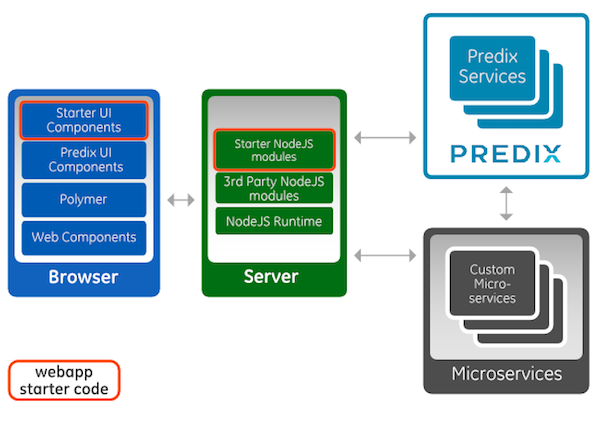
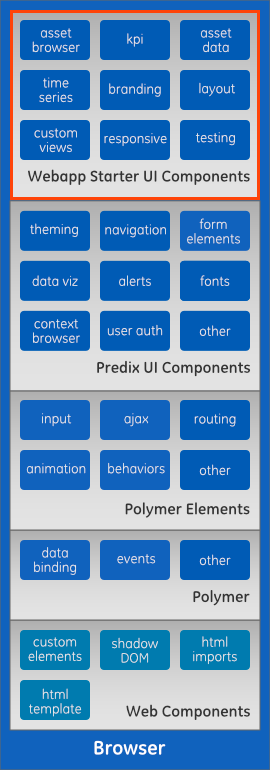
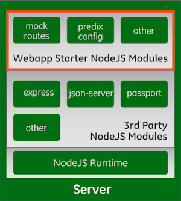
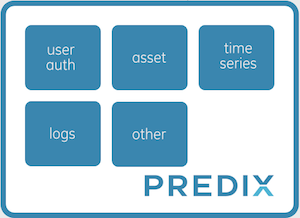
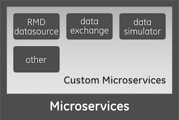

<!-- Note: the image links are a little funky.
      we're using the ../docs/images path so we can serve the images in github, or the /about page of the app.
 -->
The Predix WebApp Starter ("Starter") is a starter kit that accelerates development of modern web applications integrated with Predix™.  Developers can get faster to a Predix web application by building upon the Starter and its components than starting one on their own.  The Starter makes use of best practices and class-leading technologies to provide a highly extensible and configurable base web application that is suitable for both prototying and official development.

  

### Pre-built Features
The Starter accelerates application development by providing pre-built features in the User Interface, Middleware and Service layers, as well as configurations, automated testing, build and deployment setup.  Some of these pre-built features include:

#### User Interface
Layout, Branding, Navigation, Page Routing, Styles and Theming, Views, Header, Footer and Content elements

#### Middleware and Services
Module Configuration, Server-side Routes, Predix Services and Custom Microservice Integration

#### Mock Data
JSON files for UAA, Asset and Time Series Data.  

#### Testing and Deployment Automation
Test Framework and Examples, Cloud Manifest files

 
### Terminology
With the advent of single-page apps the lines between what is client and what is server can get confusing.  Let's take a look at the Libraries, Frameworks and Runtimes used by the predix-webapp-starter.  

|Client         |                 |Server         |               |               |
|:--------------|:----------------|:--------------|:--------------|:--------------|
|`Library`      |`Framework`      |`Runtime`      |`Libary`       |`Framework`    |
| Polymer       | none            | Node.js       | Passport      | Express       |

You also might be thinking of some other libraries, frameworks and runtimes.  Predix can run these as well and we may add starters for the popular libraries and frameworks.  Predix-UI Web Components are equally at home with any of these other libraries, frameworks, and runtimes.

|Client         |                 |Server         |                 |                 |
|:--------------|:----------------|:--------------|:----------------|:----------------|
|`Other Library`|`Other Framework`|`Other Runtime`|`Other Library`  |`Other Framework`|
| jQuery        | AngularJS       | Apache        | Socket.io       | Hapi            |
| React         | Backbone        | Nginx         |                 |                 |
|               | Ember           |               |                 |                 |
| etc           | etc             | etc           | etc             | etc             |

 
### Technologies
The Predix WebApp Starter presently uses the following technologies backed by industry best practices and alignment with Predix product strategies.

#### User Interface
##### Web Components
"A set of web platform APIs that allow you to create new custom, reusable, encapsulated HTML tags to use in web pages and web apps".  More information on <a href="http://www.webcomponents.org" target="_blank">http://www.webcomponents.org</a>.

##### Polymer
"Polymer is a JavaScript library that helps you create custom reusable HTML elements, and use them to build performant, maintainable apps. Polymer helps developers build modern Progressive Web Apps, taking full advantage of cutting-edge features like Web Components, Service Workers and HTTP/2."  More information on <a href="http://www.polymer-project.org" target="_blank">http://www.polymer-project.org</a>.

##### Predix UI Components
"Predix UI Components are a set of user interface pieces that can be quickly snapped together to build an application. Predix Web Components give you the basic building blocks of an Industrial IOT web app, freeing up your time to spend on more important development tasks. Polymer is not required for Predix UI Components, but they do work well together."  More information on <a href="http://www.predix-ui.com" target="_blank">http://www.predix-ui.com</a>.

#### Middleware and Services
##### NodeJS, ExpressJS and other Popular Node Modules
"Node.js® is a JavaScript runtime built on Chrome's V8 JavaScript engine. Node.js uses an event-driven, non-blocking I/O model that makes it lightweight and efficient. Node.js' package ecosystem, npm, is the largest ecosystem of open source libraries in the world."  More information on <a href="http://www.nodejs.org" target="_blank">http://www.nodejs.org</a>.

Express is the most popular web server that runs in the Node.js environment.  More information on <a href="http://expressjs.com" target="_blank">http://expressjs.com</a>.

##### Predix™ Services
"Predix helps you develop, deploy, and operate industrial apps at the edge and in the cloud. Securely connect machines, data, and analytics to improve operational efficiency."  Predix offers a catalog of applications and data services geared towards the Industrial Internet space.  More information on <a href="http://www.predix.io" target="_blank">http://www.predix.io</a>.

##### Custom Microservices
Microservices created by other developers can be straightforwardly integrated with the Starter.  Microservice architecture promotes encapsulation, specialization and loose coupling in implementing well-defined business capabilities.  More information on <a href="https://www.predix.io/resources/tutorials/journey.html#2041" target="_blank">Microservice Templates</a>.

While the Starter makes use of the above technology stack, it remains flexible with alternatives.  For example, the User Interface layer can (and has been shown to) work with a Python-based web server instead of the NodeJS server.  It is also agnostic on technology implementations for Predix™ Services and Custom Microservices.

 
### Runtime Overview
The diagram below shows an overview of the main runtime components of a Predix web application built on the Starter.  It shows the main process blocks ("Browser", "Server", "Predix" and "Custom Microservices") and the type of components and dependencies that make up each.

'Browser' will be running on the end-user's client computer.  'Server' will be the machine where middleware will execute and serve files to the Browser. 'Predix' is the collection of Predix services running in their designated cloud space.  'Microservices' is the collection of custom microservices running from their own cloud deployments as well.  The arrows show the direct communications between the blocks, which will mostly be in HTTP/* .

Although the Starter is presently configured so that the web server process and middleware from the same machine, there are no hard requirements for this deployment configuration.  The Starter can be modified so that the web server and middleware reside in different machines.

The diagram also shows the areas of the Starter where developers make changes when they extend and customize it for their web application project.  These are the areas in red boxes.  Changes in the 'Seed UI Components' come in the form of custom Polymer elements, JavaScript code, HTML and CSS.  Changes in 'Seed Node Modules' include custom Node modules and other server code written in JavaScript, as well as configuration changes.

### Runtime Details
Below are more detailed diagrams for each of the main runtime process blocks mentioned.  A more complete list of the pre-built features are shown mapped into each of the Browser and Server blocks.  Dependency among component types within a block are also indicated by placing dependent component types on top of the other types they depend on.  For example, Seed Custom UI Components depend on Predix UI Components, and both directly depend on Polymer Elements and on the Polymer library.  All of the preceding depend on the support for Web Components implemented in compatible browsers.

#### Browser (User Interface)

#### Server (Middleware)

#### Predix (Services)

#### Microservices (Custom Services)

### Reference Applications

#### What is a Reference Application?
A reference application is a complete example of a secure, scalable application that you can use as a model for your applications.  A reference app includes many features such as Predix services, custom microservices, security, session storage, user interface, and more.  The Predix WebApp Starter acts as the user interface component of the RMD Reference App.  For more information on the RMD Reference app, see the github repository: <a href="https://github.com/predixdev/predix-rmd-ref-app" target="_blank">https://github.com/predixdev/predix-rmd-ref-app</a>.

### Learn More
* <a href="https://www.predix.io/resources/tutorials/journey.html#1610" target="_blank">RMD Reference App tutorials</a>
* <a href="https://www.predix.io/resources/tutorials/journey.html#2100" target="_blank">Predix WebApp Starter tutorials</a>
* <a href="https://predix-toolkit.run.aws-usw02-pr.ice.predix.io/" target="_blank">Predix Toolkit (US West)</a>
* <a href="https://forum.predix.io" target="_blank">Predix.io forum</a>